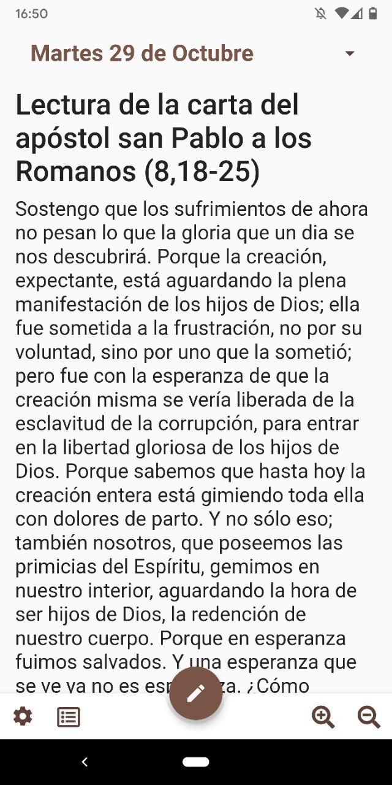
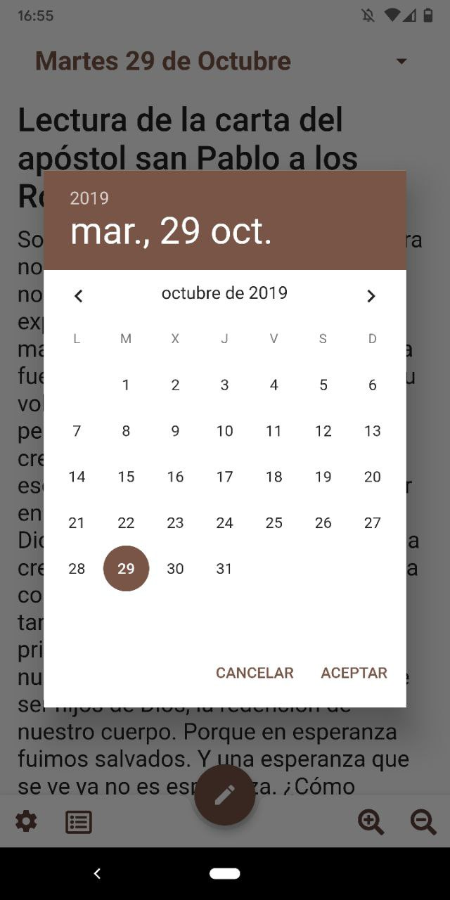
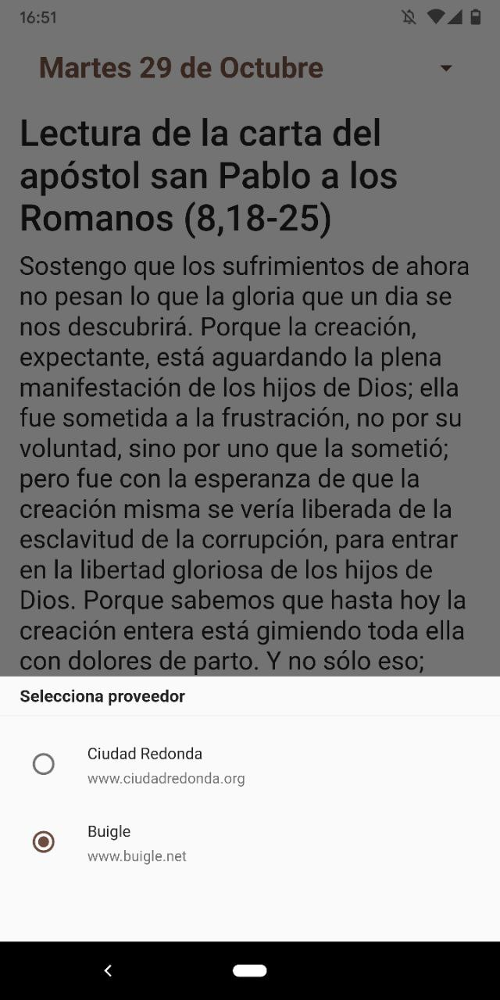
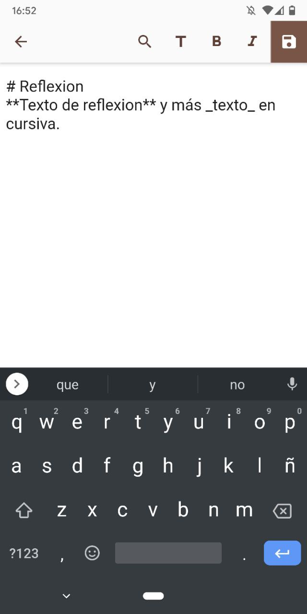
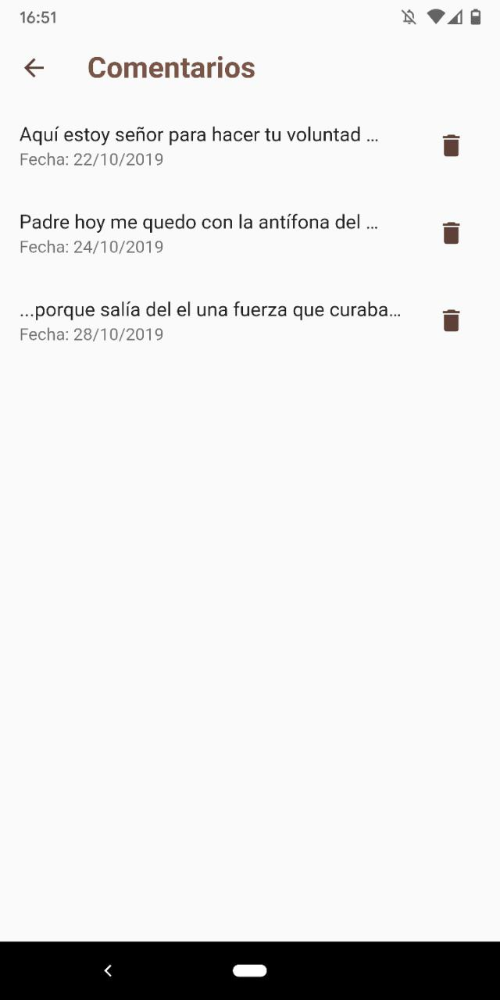
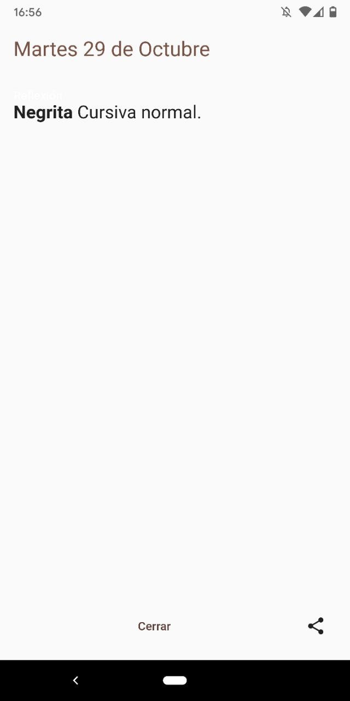

# Lecturas

Una App rapida para leer el evangelio del dia, y anotar tus propias notas, oraciones o inspiraciones que hayan salido a la luz del evangelio.

## Capturas

## Por hacer
- **Backup diario (2am, por ejemplo) a JSON a la tarjeta de memoria.**
- 'CRON' para descargar cada noche el evangelio del dia siguiente en todos los proveedores.
- Tema oscuro
- Pantalla de "Pedir por..."
